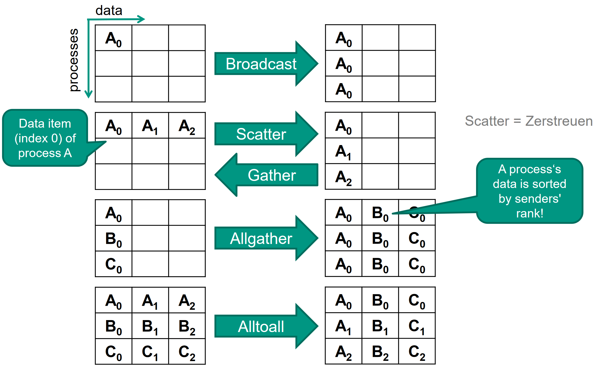

# Propa

* [Haskell](#haskell)
* [Prolog](#prolog)
* [MPI](#mpi)
* [Java](#java)

## Haskell

> Definitionen Funktion f

```haskell
f x = sin x / x -- 1 parameter function
f a x = a * x * x -- 2 parameter function
```

> Fallunterscheidung if

```haskell
binom n k =
    if (k==0) || (k==n)
    then 1
    else binom (n-1) (k-1) + binom (n-1) k
```

> Fallunterscheidung ohne if

```haskell
binom n k
    |(k==0 || k==n) = 1
    |otherwise = binom (n-1) (k-1) + binom (n-1) k
```

> Fallunterscheidung Pattern Matching

```haskell
fib 0 = 0
fib 1 = 1
fib n = fib (n - 1) + fib (n - 2)
```

> `Tail recursion` Eine Funktion heißt linear rekursiv, wenn in jedem Definitionszweig nur ein rekursiver Aufruf vorkommt. Eine linear rekursive Funktion heißt tail recursive, wenn in jedem Zweig der rekursive Aufruf nicht in andere Aufrufe eingebettet ist.

### Lists/Tuple

```haskell
(x:xs) -- Cons operator (create list from head and rest)
[] -- Empty List
(x:[]) -- One list element
[1, 2, 3, 4] -- Create list with 4 elements
(1, 2, 3, 4) -- Create tuple with 4 elements
head l -- First element of List (x)
tail l -- Without the first element l (xs)
take n l -- First n elements from l
drop n l -- l without first n elements
app a b -- Append two lists
a ++ b -- Infix notation off app
length l -- length of the list
concat [l1, l2, l3] -- Flattens elements of l to one list
filter pre l -- Filter list with predicate
map f l -- Maps each element to an other with the function
zipWith f l1 l2 -- Apply f l1x l2x
[x | x <- l] -- List generation
[x | x<-l, pred x] -- List with filter
fst t -- first element of tuple
snd t -- second element of tuple,
insert x l -- inserts at front
reverse l -- reverses a list
elem e l -- Is element in list
list !! i -- i th element of list
lookup e [(e, b)] -- Maybe b iff b in map, Nothing otherwise
```

> Foldr/Foldl

```haskell
foldr op i [] = i
foldr op i (x:xs) = op x (foldr op i xs)

foldl op i [] = i
foldl op i (x:xs) = foldl op (op i x) xs
```

> Streams/Lazy eval

```haskell
ones = 1 : ones -- Stream with unlimited ones
```

### Lambdas/Bindings

```haskell
f . g -- Composition infix notation
\x -> sin x / x -- Lambda abstraction
-- Unterversorgung:
(+) -- Infix (addition/...) as function parameter 
(+1) -- Parameterized infix notation as function
([]++) -- Parameterized list infix as function
(,) -- Tuple creation as function
(:) -- Cons as a function
-- Bind c in let and use in in body
f x = let c = 200
      in x * c
-- Bind c in where clause and use before
f x = x * c
      where c = 200
-- More power then let as it allows self recursion
-- Use function as infix notation
1 `div` 0
1 `mod` 0 
```

> WHITESPACE SENSITIVE!

### Numerical Functions

```haskell
div a b -- calculates integer division a/b
mod a b -- calculates integer modulus a % b
isDigit c -- checks if char is a digit
```

### Typisierung

```haskell
e :: t -- e is type t
s -> t -- function type
(3,True) :: (Integer,Bool) -- Tuple type
[Type] -- List type
type String = [Char] -- Type aliases
```

> Basic Types

```haskell
Int -- integer Numbers with max 32bit
Integer -- integer Numbers infinite size
Float -- floating Point 32bit
Double -- floating Point 64bit
Bool -- Boolean value
Char -- Unicode-Character
```

> Data Types

```haskell
data People = Person String Int -- Data class
-- function taking data constructor
isAdult :: People -> Bool
isAdult (Person name age) = (age>=18)
-- alternative constructors
data Shape = Circle Double -- Radius
           | Rectangle Double Double -- Lengths
-- Enums
data Season = Spring | Summer | Autumn | Winter
```

> Polymorphic Data Types

```haskell
data Maybe t = Nothing | Just t -- t is any type
-- Recursive Data Type
data Stack t = Empty | Stacked t (Stack t)
```

### Concepts/Typeclasses

```haskell
qsort :: Ord t => [t] -> [t] -- Any list type function with 
```

> Standard concepts


> Important standard implementation

```haskell
-- Eq t
(==) :: t -> t -> Bool
(/=) :: t -> t -> Bool
-- Ord t (derivativ of Eq)
(<=) :: t -> t -> Bool
(<) :: t -> t -> Bool 
-- ...
-- Show t
show :: t -> String
-- Enum t
succ :: t -> t 
pred :: t -> t
toEnum :: Int -> t 
fromEnum :: t -> Int
enumFromTo :: t -> t -> [t]
-- Num t
(+) :: t -> t -> t -- (*); (-)
abs :: t -> t
negate :: t -> t
signum :: t -> t
fromInteger :: Integer -> t
```

> Own type classes

```haskell
class Eq t where -- define new concept/class
    -- define required functions (interface)
    (==) :: t -> t -> Bool
    (/=) :: t -> t -> Bool

instance Eq Bool where -- create instance
    -- concrete implementations
    True == True = True
    False == False = True
    -- ...; /= not needed, can be inferred

-- Derivation of concepts (Ord derives from Eq)
class (Eq t) => Ord t where
    compare :: t -> t -> Ordering

-- Generic instantiation, for any s, t
instance (Eq s,Eq t) => Eq (s,t) where
    (a,b) == (a’,b’) = (a==a’) && (b==b’)
```

## Prolog

> Basic program structure

```prolog
%! Facts ("." as separator)
liebt(hans,inge).
liebt(heinz,inge).

%! Rules (Implication indicated by ":-" )
liebt(hugo,X) :- liebt(inge,X).

%! Queries
?liebt(fritz,fisch).
```

> Different Terms

```prolog
%! Atoms (lowercase)
hans, inge, franz

%! Numbers
1, 2, 3.5

%! Variables (uppercase, can hold any one value)
X, Y, Z

%! Underscore: special variable -> does not matter
_
```

> Common Operators

```prolog
X  *  Y %! Logical AND (Multiplication)
X  +  Y %! Logical OR (Addition)
X  #  Y %! Logical XOR
  ~X    %! Logical NOT (Negation)
X >=  Y %! Greater than or equal
X =<  Y %! Less than or equal %! implication
X =:= Y %! Equal
X =\= Y %! Not equal
```

> Common Predicates

```prolog
not(X). %! Inverse of X
member(X, LIST). %! Checks if X is element of LIST
fail    %! predicate that always fails
call(X) %! evaluates X and fails if X fails
append(L1, L2, OUT) %! Appends L1 and L2 to OUT
```

> Lists

```prolog
[] %! Empty list literal
[X|Y] %! Cons Operator, X is head, Y is tail

%! Example (Reversing a list):

%! The reverse of the empty list is the empty list
rev([],[]).
%! If reversing [X|R] gives Y, then concatenating X with the
%! reverse of R also gives Y
rev([X|R],Y) :- rev(R,Y1),append(Y1,[X],Y).
```

> Constructing function-like predicates

```prolog
fib(0,0). %! First fibonacci number is zero
fib(1,1). %! Second fibonacci number is one
fib(X,Y) :- X>1,
    X1 is X-1, X2 is X-2,
    fib(X1,Y1), fib(X2,Y2),
    Y is Y1+Y2.
```

> A predicate is said to be *deterministic* if it has at most one solution, otherwise it is *nondeterministic*.
> **ARITHMETIK NUR VORWAERTS ANWENDBAR!**

### Cutting off the backtrack-tree

```prolog
%! "!" operator used to eliminate choice points
%! Equivalent to saying "do not backtrack prior to this point"
max(X,Y,X) :- X>Y,!.
max(X,Y,Y) :- X=<Y.
%! Using a cutoff here makes sense, since both candidates are 
%! mutually exclusive

%! Assume the following knowledge base
a(1). a(2).
b(1). b(2).
foo(X, Y) :- a(X), b(Y).

%! Then
?- foo(X, Y).

X = 1
Y = 1 ? a

X = 1
Y = 2

X = 2
Y = 1

X = 2
Y = 2

%! Because Prolog has choice points for both X and Y.
%! If "foo" was instead defined as 
foo(X, Y) :- a(X), !, b(Y).
%! then the results look like this
?- foo(X, Y).

X = 1
Y = 1 ? a

X = 1
Y = 2
%! ...because once prolog has found a X that satisfies a(X) it will
%! never backtrack to find a different candidate for X.
```

> *Green* cuts make the program more efficient, without changing results.
> *Red* cuts eliminate some solution (potentially making the predicate deterministic)

## $\lambda$-Calculus

> Church Bool/Ints

* $C_{true} = \lambda t. \lambda f. t$
* $C_{false} = \lambda t. \lambda f. f$
* $C_0 = \lambda s. \lambda z. z$
* $C_1 = \lambda s. \lambda z. s z$
* $C_2 = \lambda s. \lambda z. s (s z)$
* $C_n = \lambda s. \lambda z. s^n z$

> Common Functions

* $succ = \lambda n. \lambda s. \lambda z. s (n s z)$
* $plus = \lambda m. \lambda n. \lambda s. \lambda z. m s (n s z)$
* $times = \lambda m. \lambda n. \lambda s. n (m s)$
* $exp = \lambda m. \lambda n. n m$
* $isZero = \lambda n. n (\lambda x. C_{false}) C_{true}$

> Y Combinator

$Y = \lambda f. (\lambda x. f (x x)) (\lambda x. f (x x))$

> **Call-by-name**: reduce most outer left redex (iff not in $\lambda$ ).
> **Call-by-value**: reduce left redex (if not in $\lambda$ ) and the argument is a value.

## Unifikator/Typinferenz

> **Unifikator**: Substitution $\sigma$ unifiziert Gleichung $\tau$ = $\tau"$ , falls $\sigma$$\tau$ = $\sigma$$\tau"$.
> $\sigma$ unifiziert C, falls $\forall c \in C$ gilt: $\sigma$ unifiziert c.
> **Allgemeinster Unifikator**: $\sigma$ mgu , falls $\forall$ Unifikator y $\exists$ Substitution o. y = o $\bullet$ $\sigma$.

## MPI

> Communicators are sub groups of processes which can communicate between each other. `MPI_COMM_WORLD` default

```c
// Init and Teardown
MPI_Init(&argc, &args);
MPI_Finalize();

// Amount of processes and current process number (rank)
int size, my_rank;
MPI_Comm_size(MPI_COMM_WORLD, &size);
MPI_Comm_rank(MPI_COMM_WORLD, &my_rank);

// Waits until all process hit this barrier
MPI_Barrier(MPI_COMM_WORLD);
```

> Communications

```c
// Blocking until buffer can be (re)used
int MPI_Send( void* buffer, int count, MPI_Datatype datatype,
              int dest, int tag, MPI_Comm comm);

// Tag and source can be wildcard
// (MPI_ANY_SOURCE, MPI_ANY_TAG)
int MPI_Recv( void* buffer, int count, MPI_Datatype datatype,
              int source, int tag, MPI_Comm comm, MPI_Status* status)

// Both with auto deadlock prevention
// _replace variant available (Only one buffer)
int MPI_Sendrecv(const void *sendbuf, int sendcount, 
     MPI_Datatype sendtype, int dest, 
     int sendtag, void *recvbuf, int recvcount,
     MPI_Datatype recvtype, int source, int recvtag,
     MPI_Comm comm, MPI_Status *status)

// None blocking nearly identical to blocking
// Buffer can not safely be reused
int MPI_Isend(/*MPI_Send w/o status, Out:*/ MPI_Request* request);
int MPI_Irecv(/*MPI_Recv w/o status, Out:*/ MPI_Request* request);
// Fence behavior for MPI_Request, to later check status
int MPI_Test(MPI_Request* r, int* flag, MPI_Status* s);
int MPI_Wait(MPI_Request* r, MPI_Status* s);
```

> Collective operations

Every process needs to participate in the operation hence need to receive or start the respektive operations needed.

```c
// Broadcast to all processes (One to All)
int MPI_Bcast(void* buffer, int count, MPI_Datatype type,
              int root, MPI_Comm comm);

// Send split data to all processes (One to All)
// Distribute evenly the memory (sendcount per element)
// FF: (v=Vector variant) int* scounts, int* displacements
int MPI_Scatter(void* sbuf, int scount, MPI_Datatype stype,
                void* rbuf, int rcount, MPI_Datatype rtype,
                int root, MPI_Comm comm);
// Inverse operation of scatter (All to One)
int MPI_Gather(/*same as scatter*/);
// Gather + Broadcast (All to All)
int MPI_Allgather(/*same as scatter w/o root*/);
// Scatter for each process (All to All)
int MPI_Alltoall(/*same as Allgather*/);
// Apply operation to each process and recv result (All to One)
int MPI_Reduce(void* sbuf, void* rbuf, int count, MPI_Datatype type, 
               MPI_Op op, int root, MPI_Comm comm):
// Allreduce/Reduce-scatter/Scan - Available
// MapReduce can be realized using MPI
// Map can be realized using MPI scatter operations
// Reduce can be realized with MPI reduce operations
```

> Scatter/Gather Examples

```c
int total = 0;
local_array = (int*) malloc(count * sizeof(int));
if (rank == 0) {
  size = count * numnodes;
  send_array =(int*) malloc(size * sizeof(int));
  back_array =(int*) malloc(numnodes * sizeof(int));
  for (i = 0; i < size; i++) send_array[i]=i;
}
MPI_Scatter(send_array, count, MPI_INT, local_array, count,
            MPI_INT, 0, MPI_COMM_WORLD);
// … (each processor sums up his local_array into back_array)
MPI_Gather(&total, 1, MPI_INT, back_array, 1, MPI_INT, 0,
           MPI_COMM_WORLD);
```



> Communication Types for Sending

Does not effect receive.
`MPI_Sendrecv` is always blocking.

* Synchronous: Waiting on both sides, no buffering
  * `MPI_Ssend`
* Buffered: Buffers, no synchronization (no knowledge of receive)
  * `MPI_Bsend`
* Ready: Receive must be ready, no sync, no buffer (garbage)
  * `MPI_Rsend`
* Standard: IMPLEMENTATION DEFINED YIPPPI
  * `MPI_Send`

> MPI_Datatype

```text
MPI_CHAR
MPI_INT8_T / MPI_UINT8_T
MPI_INT16_T / MPI_UINT16_T
MPI_INT32_T / MPI_UINT32_T
MPI_INT64_T / MPI_UINT64_T
MPI_FLOAT / MPI_DOUBLE / MPI_LONG_DOUBLE
```

> MPI Ops

```text
MPI_LAND / MPI_BAND / MPI_LOR / MPI_BOR
MPI_MAX / MPI_MIN / MPI_SUM / MPI_PROD
MPI_MINLOC / MPI_MAXLOC
```

## Java

Lambdas:

```java
() -> {}; // Runnable
() -> {return V;}; // Callable<V>, Supplier<R>
(R, T) -> {}; // BiConsumer<R, T>
R -> {}; // Consumer<R>

```

> Thread/Synchronisation

```java
public class Thread implements Runnable {
  public Thread(String name);
  public Thread(Runnable target);
  public void start();
  public void run();
}
// lock / cs / unlock (e.g. lock_guard or os locks)
synchronized (lockObject) {
  // critical section
}
// Only in synchronized, Fencing wait!
public final void wait(/*Opt:*/long timeout, int nanos);
// Fence signal (can be same)
public final void notify(); // n - 1
public final void notifyAll(); // all
```

> Coffman conditions (OS): Mutual exclusion, Hold and wait, No preemption, Circular wait

`volatile` ensures that changes to variables are immediately visible to all threads / processors

> Atomic Types/Locks

AtomicInteger, AtomicBoolean, AtomicReference, AtomicLong

```java
int get(); // volatile read
int incrementAndGet(); // ++atomic 
int decrementAndGet(): // --atomic
// Checks if value updated and sets if not
boolean compareAndSet(int oldValue, int newValue);
// used for lock free programming
// e.g. compare and set loop
boolean updated = false;
while(!updated){
  long p = this.count.get();
  updated = this.count.compareAndSet(p, p + 1);
}
// Reentrant lock can be reentered (std::recursive_mutex)
new ReentrantLock(fairLock);
void lock();
void unlock();
boolean tryLock();
// Use try-finally to have RAII behavior
public void doSomething() {
  lock.lock();
  try {} finally {
    lock.unlock();
  }
}
```

> Barriers/Executors

`CyclicBarrier(int n)` (reusable)
`await()` blocks the calling thread
If `await()` was called n times, all threads resume
`await()` blocks the calling thread
`CountDownLatch(int n)` (not reusable)
If `countdown()` was called n times, all threads resume
Further calls to `await()` return immediately

```Java
// Possible: newCachedThreadPool
ExecutorService es = Executors.[...];
Future<V> f = es.submit(Callable<T> task);
f.get(); // Waits until completion and gets result
f.isDone(); // Checks if completed
```

> Streams

* filter,
* map, reduce,
* collect,
* findAny, findFirst,
* min, max,

```Java
var personsInAuditorium = new ArrayList<Person>();
var average = personsInAuditorium
                .stream()
                .filter(Person::isStudent)
                .mapToInt(Person::getAge)
                .average()
                .getAsDouble();
```

## Grammar and Compilers

* $First_k(X)$ a set of all first k terminals that can be produced by X
  * $X \rightarrow^* \theta => k : \theta$
* $Follow_k(X)$ a set of all first k terminals that are followings of X
  * $S \rightarrow^* aXw => First_k(w)$
* $SSL(k)$ is the set of all Grammars which have disjoint (first) index sets
  * $First_k(aFollow_k(A)) \cap First_k(bFollow_k(B))$
* Left recursive cf Grammars are for no k $SSL(k)$
* Every left recursive cf Grammar can be transformed into a none left recursive Grammar

### Java Byte Code

* Locals: `?load_X`, `?store_X`
* Constants: `?const_C`
* Globals: `getfield`, `putfield`
* Branches: `ifeq`, `ifnull`, `tableswitch`
  * `goto label`, `ifle`, `ifge` ...
* Invoke: `invokevirtual`, `invokestatic`
  * `?return`
* New: `new`, `newarray`
* Arithmetic: `?mul`, `?add`

> Definitions

* Objekts: `Ljava/lang/Object;`
* Primitives: `int=I`, `void=V`, `boolean=Z`
* Concatenation: `IZIZ` -> `int, boolean, int, boolean`
* Constructor: `<init>`
* Static Block: `<clinit>`
* Methode: `foo(ILjava/lang/Object;)V`
* Field: `putfield Foo.field:LBar;`

> Arrays

```text
bipush 10
newarray int // new int[10]
astore 1
aload 1
bipush 7
bipush 35
iastore // array[7] = 35
```

> Umgekehrte polnische Notation (UPN)

first the operands than the actual operator.
`7 * 4 => 7 4 *`
