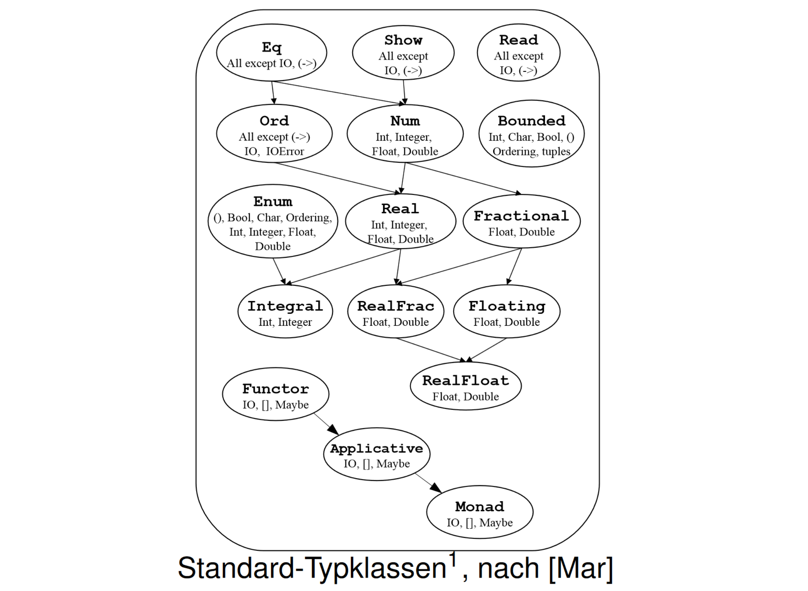

# Propa

* [Haskell](#haskell)
* [Prolog](#prolog)

## Haskell

> Definitionen Funktion f

```haskell
f x = sin x / x -- 1 parameter function
f a x = a * x * x -- 2 parameter function
```

> Fallunterscheidung if

```haskell
binom n k =
    if (k==0) || (k==n)
    then 1
    else binom (n-1) (k-1) + binom (n-1) k
```

> Fallunterscheidung ohne if

```haskell
binom n k
    |(k==0 || k==n) = 1
    |otherwise = binom (n-1) (k-1) + binom (n-1) k
```

> Fallunterscheidung Pattern Matching

```haskell
fib 0 = 0
fib 1 = 1
fib n = fib (n - 1) + fib (n - 2)
```

> `Tail recursion` Eine Funktion heißt linear rekursiv, wenn in jedem Definitionszweig nur ein rekursiver Aufruf vorkommt. Eine linear rekursive Funktion heißt tail recursive, wenn in jedem Zweig der rekursive Aufruf nicht in andere Aufrufe eingebettet ist.

### Lists/Tuple

```haskell
(x:xs) -- Cons operator (create list from head and rest)
[] -- Empty List
(x:[]) -- One list element
[1, 2, 3, 4] -- Create list with 4 elements
(1, 2, 3, 4) -- Create tuple with 4 elements
head l -- First element of List (x)
tail l -- Without the first element l (xs)
take n l -- First n elements from l
drop n l -- l without first n elements
app a b -- Append two lists
a ++ b -- Infix notation off app
length l -- length of the list
concat [l1, l2, l3] -- Flattens elements of l to one list
filter pre l -- Filter list with predicate
map f l -- Maps each element to an other with the function
zipWith f l1 l2 -- Apply f l1x l2x
[x | x <- l] -- List generation
[x | x<-l, pred x] -- List with filter
fst t -- first element of tuple
snd t -- second element of tuple,
insert x l -- inserts at front
reverse l -- reverses a list
```

> Foldr/Foldl

```haskell
foldr op i [] = i
foldr op i (x:xs) = op x (foldr op i xs)

foldl op i [] = i
foldl op i (x:xs) = foldl op (op i x) xs
```

> Streams/Lazy eval

```haskell
ones = 1 : ones -- Stream with unlimited ones
```

### Lambdas/Bindings

```haskell
f . g -- Composition infix notation
\x -> sin x / x -- Lambda abstraction
-- Unterversorgung:
(+) -- Infix (addition/...) as function parameter 
(+1) -- Parameterized infix notation as function
([]++) -- Parameterized list infix as function
(,) -- Tuple creation as function
(:) -- Cons as a function
-- Bind c in let and use in in body
f x = let c = 200
      in x * c
-- Bind c in where clause and use before
f x = x * c
      where c = 200
-- More power then let as it allows self recursion
-- Use function as infix notation
1 `div` 0
1 `mod` 0 
```

> WHITESPACE SENSITIVE!

### Numerical Functions

```haskell
div a b -- calculates integer division a/b
mod a b -- calculates integer modulus a % b
isDigit c -- checks if char is a digit
```

### Typisierung

```haskell
e :: t -- e is type t
s -> t -- function type
(3,True) :: (Integer,Bool) -- Tuple type
[Type] -- List type
type String = [Char] -- Type aliases
```

> Basic Types

```haskell
Int -- integer Numbers with max 32bit
Integer -- integer Numbers infinite size
Float -- floating Point 32bit
Double -- floating Point 64bit
Bool -- Boolean value
Char -- Unicode-Character
```

> Data Types

```haskell
data People = Person String Int -- Data class
-- function taking data constructor
isAdult :: People -> Bool
isAdult (Person name age) = (age>=18)
-- alternative constructors
data Shape = Circle Double -- Radius
           | Rectangle Double Double -- Lengths
-- Enums
data Season = Spring | Summer | Autumn | Winter
```

> Polymorphic Data Types

```haskell
data Maybe t = Nothing | Just t -- t is any type
-- Recursive Data Type
data Stack t = Empty | Stacked t (Stack t)
```

### Concepts/Typeclasses

```haskell
qsort :: Ord t => [t] -> [t] -- Any list type function with 
```

> Standard concepts



> Important standard implementation

```haskell
-- Eq t
(==) :: t -> t -> Bool
(/=) :: t -> t -> Bool
-- Ord t (derivativ of Eq)
(<=) :: t -> t -> Bool
(<) :: t -> t -> Bool 
-- ...
-- Show t
show :: t -> String
-- Enum t
succ :: t -> t 
pred :: t -> t
toEnum :: Int -> t 
fromEnum :: t -> Int
enumFromTo :: t -> t -> [t]
-- Num t
(+) :: t -> t -> t -- (*); (-)
abs :: t -> t
negate :: t -> t
signum :: t -> t
fromInteger :: Integer -> t
```

> Own type classes

```haskell
class Eq t where -- define new concept/class
    -- define required functions (interface)
    (==) :: t -> t -> Bool
    (/=) :: t -> t -> Bool

instance Eq Bool where -- create instance
    -- concrete implementations
    True == True = True
    False == False = True
    -- ...; /= not needed, can be inferred

-- Derivation of concepts (Ord derives from Eq)
class (Eq t) => Ord t where
    compare :: t -> t -> Ordering

-- Generic instantiation, for any s, t
instance (Eq s,Eq t) => Eq (s,t) where
    (a,b) == (a’,b’) = (a==a’) && (b==b’)
```

## Prolog

> Basic program structure

```prolog
%! Facts ("." as separator)
liebt(hans,inge).
liebt(heinz,inge).

%! Rules (Implication indicated by ":-" )
liebt(hugo,X) :- liebt(inge,X).

%! Queries
?liebt(fritz,fisch).
```

> Different Terms

```prolog
%! Atoms (lowercase)
hans, inge, franz

%! Numbers
1, 2, 3.5

%! Variables (uppercase, can hold any one value)
X, Y, Z

%! Underscore: special variable -> does not matter
_
```

> Common Operators

```prolog
X  *  Y %! Logical AND (Multiplication)
X  +  Y %! Logical OR (Addition)
X  #  Y %! Logical XOR
  ~X    %! Logical NOT (Negation)
X >=  Y %! Greater than or equal
X =<  Y %! Less than or equal %! implication
X =:= Y %! Equal
X =\= Y %! Not equal
```

> Common Functions

```prolog
not(X). %! Inverse of X
member(X, LIST). %! Checks if X is element of LIST
```

> Lists

```prolog
[] %! Empty list literal
[X|Y] %! Cons Operator, X is head, Y is tail

%! Example (Reversing a list):

%! The reverse of the empty list is the empty list
rev([],[]).
%! If reversing [X|R] gives Y, then concatenating X with the
%! reverse of R also gives Y
rev([X|R],Y) :- rev(R,Y1),append(Y1,[X],Y).
```

> Constructing function-like predicates

```prolog
fib(0,0). %! First fibonacci number is zero
fib(1,1). %! Second fibonacci number is one
fib(X,Y) :- X>1,
    X1 is X-1, X2 is X-2,
    fib(X1,Y1), fib(X2,Y2),
    Y is Y1+Y2.
```

> A predicate is said to be *deterministic* if it has at most one solution, otherwise it is *nondeterministic*.

### Cutting off the backtrack-tree

```prolog
%! "!" operator used to eliminate choice points
%! Equivalent to saying "do not backtrack prior to this point"
max(X,Y,X) :- X>Y,!.
max(X,Y,Y) :- X=<Y.
%! Using a cutoff here makes sense, since both candidates are 
%! mutually exclusive

%! Assume the following knowledge base
a(1). a(2).
b(1). b(2).
foo(X, Y) :- a(X), b(Y).

%! Then
?- foo(X, Y).

X = 1
Y = 1 ? a

X = 1
Y = 2

X = 2
Y = 1

X = 2
Y = 2

%! Because Prolog has choice points for both X and Y.
%! If "foo" was instead defined as 
foo(X, Y) :- a(X), !, b(Y).
%! then the results look like this
?- foo(X, Y).

X = 1
Y = 1 ? a

X = 1
Y = 2
%! ...because once prolog has found a X that satisfies a(X) it will
%! never backtrack to find a different candidate for X.
```

> *Green* cuts make the program more efficient, without changing results.
> *Red* cuts eliminate some solution (potentially making the predicate deterministic)

Miscellaneous Utilities:

```prolog
fail    %! predicate that always fails
call(X) %! evaluates X and fails if X fails
```
